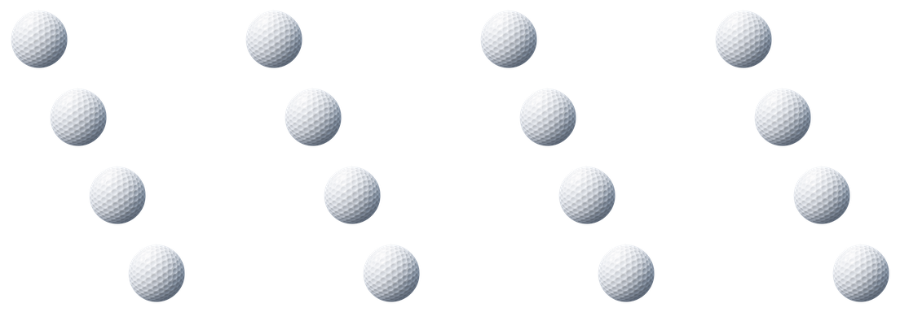
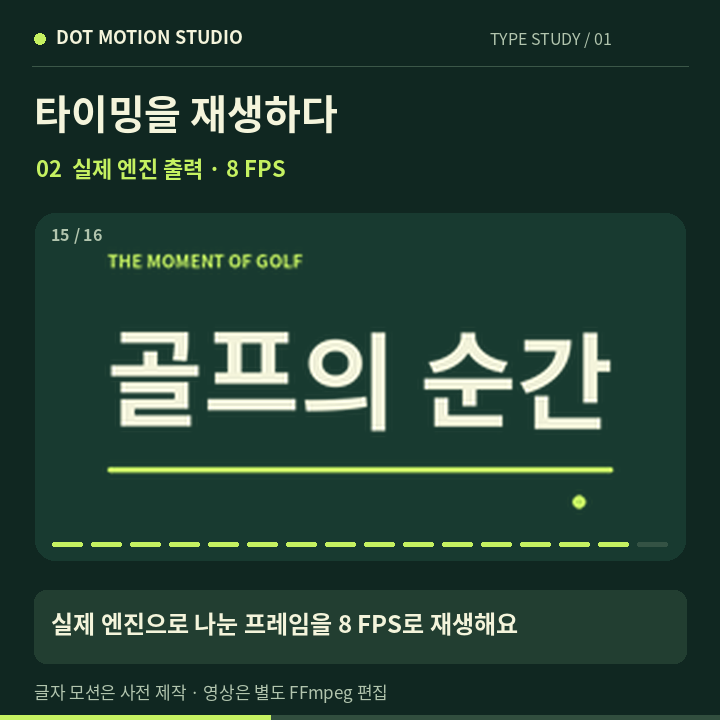
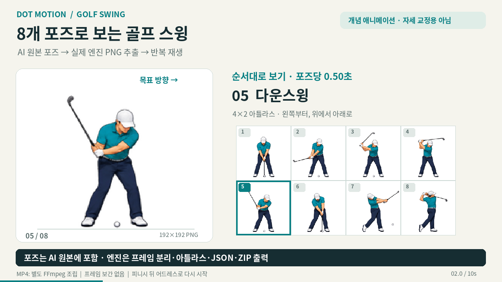

# Dot Motion Studio

**PNG 스프라이트 시트를 나누고, 투명도를 정리하고, 간단한 2D 이동을 만드는 한국어 도구입니다.**

- **바로 사용:** [Dot Motion Studio](https://dot-motion-studio.jakeshin.chatgpt.site)
- **웹 사용 가이드:** [Studio 사용 가이드](https://dot-motion-studio.jakeshin.chatgpt.site/guide)
- **소스:** [devdevra/dot-motion-studio](https://github.com/devdevra/dot-motion-studio)

이미 그려진 프레임을 정확한 규칙으로 처리합니다. 같은 입력과 옵션으로 재현할 수 있는 픽셀 연산을 사용하며, 이미지 생성 모델이나 유료 생성 API를 호출하지 않습니다.

> Site 화면은 공개되어 있지만, PNG 검사와 변환에는 ChatGPT 로그인이 필요합니다. Site 공개, 개인 스킬 등록, MCP 플러그인 설치·연결은 각각 별개입니다. 실제 도구 호출을 확인하기 전에는 플러그인 연결이 완료된 것으로 간주하지 마세요.

## 목차

1. [무엇을 할 수 있나요?](#features)
2. [웹에서 바로 사용하기](#quick-start)
3. [실제 출력 이미지와 한국어 영상](#demo)
4. [ChatGPT·Codex와 연결하기](#connect)
5. [실전 예제: 골프 시트와 2D 이동](#examples)
6. [PNG 형식과 처리 제한](#limits)
7. [MCP 도구와 입력 옵션](#mcp)
8. [출력 데이터와 파일 구조](#outputs)
9. [문제 해결](#troubleshooting)
10. [개발·테스트·배포](#development)
11. [개인정보·보안·출처·라이선스](#privacy-license)

<a id="features"></a>
## 1. 무엇을 할 수 있나요?

| 작업 | 지원 내용 |
| --- | --- |
| PNG 검사 | 가로·세로 크기, 비트 깊이, 실제 투명·반투명·불투명 픽셀 수, 보이는 영역 확인 |
| 한 장 정리 | 알파 임계값 적용, 투명 바깥 여백 자르기, 캔버스 여백 추가 |
| 시트 나누기 | 균등한 격자 또는 명시한 픽셀 사각형으로 프레임 추출 |
| 프레임 정렬 | 동일 크기의 투명 캔버스에 가운데 또는 바닥 기준 정렬 |
| 2D 이동 | 한 프레임을 매번 정수 X·Y 픽셀만큼 이동하고 캔버스를 확장 |
| 미리보기 | 브라우저 Canvas에서 순서대로 반복 재생, 일시정지, 프레임 탐색 |
| 내보내기 | RGBA8 PNG 아틀라스, JSON 좌표·타이밍, 선택적 개별 PNG ZIP |
| 대화형 사용 | `motion_capabilities`, `inspect_png`, `build_sprite` MCP 도구 |

### 지원하지 않는 것

- 한 장에서 새로운 골프 스윙·걷기·달리기 포즈 생성
- AI 배경 제거, 흰색·체크무늬 배경의 의미 기반 제거
- 중간 프레임 생성, 광학 흐름 기반 보간, 뼈대·관절 애니메이션
- 회전·확대·축소 애니메이션, 경로·곡선·가속도·왕복 이동 생성
- 3D 모델링, 모션 캡처, 영상에서 동작 추출
- GIF·APNG·MP4·WebM 등 애니메이션 파일의 입력·직접 출력
- URL에서 원본 다운로드, 외부 생성 서비스 호출, 셸 실행

골프 스윙을 재생하려면 **스윙의 여러 포즈가 이미 들어 있는 PNG 시트**가 필요합니다. 한 장의 골퍼 PNG에 `2D 이동`을 적용하면 같은 포즈 전체가 이동합니다.

<a id="quick-start"></a>
## 2. 웹에서 바로 사용하기

설치 없이 [Studio](https://dot-motion-studio.jakeshin.chatgpt.site)를 열어 사용할 수 있습니다.

### 2.1 기본 순서

1. 화면에 **ChatGPT로 로그인**이 보이면 로그인합니다.
2. **PNG를 여기에 놓으세요** 영역에 PNG 한 개를 놓거나 눌러 파일을 선택합니다. 파일을 선택할 때 서버에서 PNG 구조와 투명도를 검사합니다.
3. 작업 방식을 고릅니다.
   - **한 장 정리:** 한 장의 투명 여백·정렬을 정리합니다.
   - **시트 나누기:** 가로 칸, 세로 칸, 실제 프레임 수를 입력합니다.
   - **2D 이동:** 프레임 수와 프레임당 X·Y 이동량을 입력합니다.
4. **정리 & 타이밍**에서 FPS, 여백, 정렬, 자르기, 알파 정리를 설정합니다.
5. **스프라이트 만들기**를 누릅니다. 옵션만 바꾸면 기존 결과가 자동으로 다시 생성되지는 않습니다.
6. **미리보기**와 **아틀라스**를 번갈아 확인합니다. 재생을 멈추고 슬라이더로 첫 프레임·마지막 프레임, 잘린 부분, 발 위치, 투명 가장자리를 확인합니다.
7. 필요한 출력 버튼을 눌러 저장합니다.

| 다운로드 버튼 | 파일 | 용도 |
| --- | --- | --- |
| PNG 아틀라스 | `sprite-atlas.png` | 모든 프레임을 한 장으로 묶은 정적 이미지 |
| JSON 메타데이터 | `sprite-atlas.json` | 프레임 좌표, 크기, 순서, FPS, 프레임별 시간 |
| PNG 프레임 ZIP | `sprite-frames.zip` | `sprite-001.png`부터 시작하는 개별 PNG와 JSON |

**PNG 아틀라스와 JSON을 함께 저장하세요.** PNG 자체에는 재생 시간이나 프레임 순서가 저장되지 않습니다. ZIP에는 개별 프레임과 JSON이 들어 있고, 아틀라스 PNG는 별도 다운로드입니다.

앱은 업로드나 결과를 저장하지 않습니다. **새로고침하거나 페이지를 닫기 전에 다운로드하세요.** 다른 파일을 고르면 이전 결과도 초기화됩니다.

### 2.2 웹 화면의 기본값

- 처음 작업 방식: `한 장 정리`
- FPS: `12`
- 여백: 각 방향 `8px`
- 이미지 정렬: `가운데`
- 투명한 바깥 여백 자르기: 처음에는 켜짐
- 알파 정리: `0`
- 시트 설정: 가로 `4`, 세로 `2`, 프레임 수 `8`
- 2D 이동 설정: `12`프레임, X `2`, Y `0`

`시트 나누기`를 선택하면 원래 셀의 기준점을 보존하도록 자르기가 자동으로 꺼집니다. 이후에도 작업에 맞는지 확인하세요. 원본 셀 크기까지 그대로 유지하려면 **여백도 0**으로 설정합니다.

웹 화면은 기본 작업에 집중합니다. 임의 사각형 추출, 격자 바깥 여백·칸 사이 간격, 출력 이름, 정확한 정규화 캔버스 크기, 아틀라스 열 수는 MCP 옵션으로 지정할 수 있습니다. 웹에서는 세 가지 다운로드를 모두 준비하지만, MCP의 프레임 ZIP은 기본적으로 생략됩니다.

<a id="demo"></a>
## 3. 실제 출력 이미지와 한국어 영상

아래 자료는 저장소의 실제 `runPipeline` 엔진을 실행한 결과입니다. **96×96 투명 골프공 한 장 → 오른쪽으로 12px씩 16프레임 이동 → 아틀라스·JSON·ZIP 저장**을 보여 줍니다.

### 한국어 설명 영상

[](docs/demo/dot-motion-demo-ko.mp4)

- **[한국어 설명 영상 MP4 보기·다운로드](docs/demo/dot-motion-demo-ko.mp4)**: 24초, 1280×720, 12fps, 약 338KB
- GIF 미리보기는 아직 게시되지 않았습니다. 현재는 위 포스터와 MP4를 이용하세요.
- **[한국어 대본](docs/demo/TRANSCRIPT.ko.md)** · [SRT 자막](docs/demo/dot-motion-demo-ko.srt) · [VTT 자막](docs/demo/dot-motion-demo-ko.vtt)

영상은 **한국어 화면 자막이 있는 무음 설명 영상**입니다. 입력, 옵션, 실제 아틀라스, 출력 파일을 순서대로 보여 줍니다. GitHub에서 MP4가 바로 재생되지 않으면 파일을 다운로드해 재생하세요.

### 입력과 실제 출력

**입력 PNG: 96×96**


**실제 엔진 출력 아틀라스: 1104×384, 4열×4행**



- [원본 데모 PNG](docs/demo/golf-ball-input.png)
- [아틀라스 PNG](docs/demo/golf-ball-atlas.png) · [JSON 메타데이터](docs/demo/golf-ball-atlas.json)
- [개별 PNG 16개와 JSON이 들어 있는 ZIP](docs/demo/golf-ball-frames.zip)
- [실행 옵션](docs/demo/golf-ball-options.json) · [재현 방법과 에셋 출처](docs/demo/REPRODUCE.md)

실제 옵션은 `trim:false`, `padding:0`, `alphaThreshold:0`, `frames:16`, `dx:12`, `dy:0`, `fps:12`, `atlasColumns:4`입니다. 각 프레임은 276×96px이며 합산 출력 예산은 847,872픽셀입니다. JSON의 프레임 시간은 83ms입니다.

**데모의 범위:** 입력 골프공 이미지는 데모용으로 별도의 이미지 생성 도구에서 만든 뒤 96×96 PNG로 준비한 에셋입니다. Studio는 그 한 장을 이동했으며 골프 스윙·새 포즈를 생성하지 않았습니다. MP4는 실제 출력 PNG를 별도의 FFmpeg 제작 과정으로 조립한 설명 자료이고, Studio의 네이티브 영상 출력이나 웹 UI 화면 녹화가 아닙니다. 이 로컬 엔진 실행은 실서비스의 MCP 플러그인 연결 성공을 의미하지 않습니다.


### 추가 샘플: 한글 타이포그래픽과 골프 스윙

**한글 타이포그래픽 · “골프의 순간”**

[](docs/extra-cases/typography/typography-ko.mp4)

- **[10초 한국어 MP4](docs/extra-cases/typography/typography-ko.mp4)**: 720×720, 24 FPS, 무음
- [원본·출력 비교](docs/extra-cases/typography/typography-comparison.png) · [PNG 시퀀스 ZIP](docs/extra-cases/typography/typography-frames.zip) · [설정·검증·재현](docs/extra-cases/typography/README.md)
- 정확한 한글은 Noto Sans CJK 폰트로 외부에서 준비한 16프레임입니다. 엔진은 이미 그려진 글자 프레임을 분리하고 아틀라스·JSON·ZIP을 출력합니다. 글자 모션 생성 기능을 뜻하지 않습니다.

**골프 스윙 · 8개 AI 키 포즈**

[](docs/extra-cases/golf-swing/golf-swing-ko.mp4)

- **[10초 한국어 MP4](docs/extra-cases/golf-swing/golf-swing-ko.mp4)**: 1280×720, 24 FPS, 무음
- [입력·출력 비교](docs/extra-cases/golf-swing/golf-swing-comparison.png) · [준비된 입력 PNG](docs/extra-cases/golf-swing/golf-swing-input.png) · [PNG 시퀀스 ZIP](docs/extra-cases/golf-swing/golf-swing-frames.zip) · [설정·검증·재현](docs/extra-cases/golf-swing/README.md)
- 성인 골퍼의 개념 애니메이션이며 골프 지도·자세 교정·생체역학 검증 자료가 아닙니다. 04번 포즈의 공 누락, 01·06번 공과 클럽 헤드 겹침, 포즈별 비례·투영 길이 차이가 남습니다.
- AI 원본 PNG 공개와 원본 준비 단계의 공개 재현은 대기 중입니다. 현재 공개된 준비 입력에서 엔진 추출·아틀라스·ZIP과 영상 조립은 재현할 수 있습니다.

두 MP4는 변경하지 않은 로컬 엔진의 실제 PNG 출력을 별도 FFmpeg로 조립했습니다. 중간 포즈 보간이나 라이브 MCP 연결 성공을 시연하지 않습니다. 원본·출력·해시·제작 범위는 각 샘플 문서에서 확인할 수 있습니다.

<a id="connect"></a>
## 4. ChatGPT·Codex와 연결하기

### 4.1 웹, 개인 스킬, MCP의 차이

| 구성 | 하는 일 | 따로 확인할 것 |
| --- | --- | --- |
| Studio 웹 | 직접 업로드·설정·다운로드 | Site에서 ChatGPT 로그인 |
| `dot-motion` 개인 스킬 | 어떤 입력·옵션을 선택하고 결과를 확인할지 안내 | 사용 중인 계정의 스킬 설치 상태 |
| Site의 MCP 플러그인 | 대화에서 이미지 검사·변환 도구 실행 | 플러그인 설치 및 인증 연결 |

GitHub 저장소를 내려받거나 개인 스킬을 등록하는 것만으로 MCP 연결이 만들어지지는 않습니다. 저장소의 [`skills/dot-motion`](skills/dot-motion)은 재사용 가능한 스킬 원본입니다.

### 4.2 정식 Site 플러그인 설치·연결

1. ChatGPT 또는 Codex에서 **Dot Motion Studio Site의 플러그인을 설치·연결해 달라**고 요청합니다.
2. 제공되는 공식 플러그인 설정 화면에서 설치하고, 연결이 필요하면 안내에 따라 연결합니다. 설치와 인증 연결은 별도 단계일 수 있습니다.
3. 설정 화면을 표시할 수 없거나 이미 설치되어 있다면 **Plugins → Personal → Created by you**에서 해당 Site의 **Dot Motion Studio**를 열고 **Install** 또는 **Connect**를 선택합니다. 이 경로는 자신이 만든 Site의 플러그인을 관리하는 경로입니다.
4. 연결 후 `motion_capabilities` 호출로 도구가 실제로 보이는지 확인합니다.
5. 자신이 제공한 작은 PNG를 `inspect_png`로 검사해 로그인된 이미지 처리까지 확인합니다. 기능 안내 호출만 성공한 경우 이미지 처리 권한까지 확인된 것은 아닙니다.

Site가 제공하는 기존 플러그인을 사용합니다. 별도 App·플러그인을 중복 생성하거나, 로컬 MCP 설정을 추가하거나, `codex mcp add`·`codex mcp login`을 실행할 필요가 없습니다. 이 앱을 위해 API 키를 발급하거나 전달하지 마세요.

**사이트가 열리는 것과 MCP가 연결되는 것은 다릅니다.** 설치·업데이트 오류가 표시되면 연결 성공으로 간주하지 말고 위 관리 화면에서 현재 설치·연결 상태를 확인하세요. 해당 계정에서 플러그인을 찾을 수 없다면 Site 소유자에게 접근 가능 여부를 확인합니다. 웹에서 로그인 후 직접 처리하는 경로도 사용할 수 있습니다.

**확인된 연결 문제(2026-10-04):** “이 플러그인을 업데이트하지 못했습니다. 다시 시도하세요.”라는 오류에 대한 해결과 실제 MCP 연결 성공은 아직 확인되지 않았습니다. 반복 재시도, 플러그인 삭제·재생성을 해결책으로 안내하지 않습니다. 오류 화면·앱 버전·발생 시각을 기록해 앱의 공식 피드백·지원 경로로 전달하세요. 토큰·쿠키·비공개 이미지 등은 포함하지 마세요.

### 4.3 개인 스킬 사용

개인 스킬이 설치되어 있다면 관련 요청에 자동으로 적용되거나, `@dot-motion`으로 지정할 수 있습니다. 아직 없다면 이 저장소의 `skills/dot-motion`을 개인 스킬로 설치해 달라고 요청하세요. 스킬 목록에서 설치 상태를 확인합니다. 모바일에서는 사이드바의 **Plugins → Skills**에서 확인할 수 있습니다.

요청 예시:

> @dot-motion 이 4×2 PNG 시트를 8프레임으로 나눠 줘. 원래 셀 정렬과 크기를 유지하고 12 FPS로 PNG 아틀라스와 JSON을 만들어 줘.

> @dot-motion 이 투명 골프공 PNG를 오른쪽으로 매 프레임 2픽셀씩, 12프레임 이동시켜 줘. 개별 PNG ZIP도 필요해.

스킬의 권장 순서는 **기능 확인 → PNG 검사 → 옵션 결정 → 변환 → 결과 확인 → 파일 저장**입니다. 사용할 이미지를 대화에 제공하고 격자·프레임 수·FPS를 명시하면 정확하게 진행할 수 있습니다. 등록된 스킬이 보이지 않으면 스킬 화면을 새로고침하거나 새 대화에서 확인하세요.

<a id="examples"></a>
## 5. 실전 예제: 골프 시트와 2D 이동

이 절의 JSON은 `build_sprite`에 넘기는 **도구 인수**입니다. `"<PNG_BASE64>"`는 설명용 자리 표시자이며 실제 PNG 바이트의 표준 Base64로 바꿔야 합니다. URL이나 파일 경로를 넣을 수 없습니다. 일반 사용자는 JSON을 직접 작성하지 않고 파일과 원하는 조건을 대화로 전달해도 됩니다.

### 예제 A. 이미 그려진 골프 스윙 8프레임 분리

가정: 512×256 PNG에 128×128 셀이 4열×2행으로 있고, 각 셀이 같은 발 위치·기준점을 공유합니다. 읽는 순서는 왼쪽→오른쪽, 위→아래입니다.

웹 설정:

- `시트 나누기` → 가로 4, 세로 2, 프레임 수 8
- FPS 12, 여백 0, 자르기 끔, 알파 정리 0
- 첫 프레임과 마지막 프레임에서 발 위치·골프채 끝이 유지되는지 확인

MCP 인수:

```json
{
  "pngBase64": "<PNG_BASE64>",
  "options": {
    "name": "golf-swing",
    "source": { "kind": "grid", "columns": 4, "rows": 2, "count": 8 },
    "alphaThreshold": 0,
    "normalize": { "padding": 0, "align": "center", "trim": false },
    "fps": 12,
    "atlasColumns": 4
  },
  "includeSequenceZip": true
}
```

예상 결과: 128×128 프레임 8개, 512×256 아틀라스, 프레임별 `duration: 83`ms, 개별 PNG 8개와 JSON이 담긴 ZIP입니다. 첫 셀과 마지막 셀의 내용이 자연스럽게 이어지는지는 원본에 달려 있습니다.

**왜 `trim:false`인가요?** 스윙 포즈마다 보이는 영역의 크기가 다릅니다. 각각 잘라 가운데로 재정렬하면 원래 고정된 발이나 회전 중심이 흔들릴 수 있습니다. 이미 정렬된 셀은 캔버스를 보존하세요. 바닥 맞춤 역시 모든 동작에서 원래 기준점을 보존하는 것은 아닙니다.

### 예제 B. 투명 골프공을 오른쪽으로 이동

가정: 원본은 32×32 PNG 한 장입니다. 원본 캔버스를 보존하고 각 방향에 4px 여백을 더한 뒤, 오른쪽으로 매 프레임 2px씩 12프레임을 만듭니다.

```json
{
  "pngBase64": "<PNG_BASE64>",
  "options": {
    "name": "golf-ball-slide",
    "source": { "kind": "single" },
    "alphaThreshold": 0,
    "normalize": { "padding": 4, "align": "center", "trim": false },
    "motion": { "frames": 12, "dx": 2, "dy": 0 },
    "fps": 12,
    "atlasColumns": 4
  },
  "includeSequenceZip": true
}
```

계산 결과:

- 정규화 후 원본 캔버스: 40×40px
- 마지막 프레임까지 이동 거리: `2 × (12 − 1) = 22px`
- 각 출력 프레임: 62×40px
- 아틀라스: 4열×3행, 248×120px
- 프레임 픽셀 합 + 아틀라스 픽셀: `12 × 62 × 40 + 248 × 120 = 59,520`

X가 양수면 오른쪽, 음수면 왼쪽입니다. Y가 양수면 아래, 음수면 위입니다. 이미지가 잘리지 않도록 캔버스가 전체 이동 범위만큼 커집니다.

**반복 재생 시 마지막 위치에서 첫 위치로 돌아갑니다.** 자동 왕복, 곡선 궤도, 회전, 공의 물리 시뮬레이션, 매끄러운 루프를 생성하지 않습니다.

### 예제 C. 불규칙한 시트에서 지정한 두 영역만 추출

가정: 입력은 최소 88×56px이며 원하는 영역이 서로 다른 위치·크기에 있습니다.

```json
{
  "pngBase64": "<PNG_BASE64>",
  "options": {
    "name": "selected-poses",
    "source": {
      "kind": "rects",
      "rects": [
        { "x": 0, "y": 0, "width": 32, "height": 32 },
        { "x": 64, "y": 16, "width": 24, "height": 40 }
      ]
    },
    "normalize": { "width": 48, "height": 48, "padding": 4, "align": "bottom", "trim": false },
    "fps": 8,
    "atlasColumns": 2
  }
}
```

배열 순서대로 48×48 프레임 2개를 만들고, 96×48 아틀라스로 묶습니다. `includeSequenceZip`을 생략했으므로 ZIP은 반환하지 않습니다. `rects`는 포즈를 자동 탐지하지 않으며, 좌표는 입력 이미지의 왼쪽 위를 `(0, 0)`으로 계산합니다. 서로 다른 크기의 영역을 같은 캔버스로 옮기는 것이 원본의 공통 기준점을 복원해 주지는 않습니다.

<a id="limits"></a>
## 6. PNG 형식과 처리 제한

### 6.1 지원 PNG

정적·비인터레이스 PNG를 지원합니다.

| PNG 색상 형식 | 색상 타입 | 지원 비트 깊이 |
| --- | --- | --- |
| 그레이스케일 | 0 | 1, 2, 4, 8, 16 |
| RGB | 2 | 8, 16 |
| 인덱스 팔레트 | 3 | 1, 2, 4, 8 |
| 그레이스케일 + 알파 | 4 | 8, 16 |
| RGBA | 6 | 8, 16 |

- 적법한 `tRNS` 투명 정보도 읽습니다.
- 16비트 채널은 상위 바이트를 사용해 8비트로 변환합니다. 16비트 정밀도가 유지되지는 않습니다.
- 출력은 항상 RGBA8 PNG입니다. 원본의 텍스트·색상 프로필 등 부가 메타데이터는 보존하지 않습니다.
- APNG, 인터레이스 PNG, 손상된 PNG, 지원하지 않는 필수 청크는 거절합니다.
- JPEG·WebP·GIF 등은 먼저 정적 비인터레이스 PNG로 변환해야 합니다. 확장자만 `.png`로 바꾸는 것으로는 변환되지 않습니다.

### 6.2 크기 제한

웹과 MCP의 현재 공개 제한입니다. 실제 연결 시에는 `motion_capabilities`의 결과도 확인하세요.

| 항목 | 제한 |
| --- | --- |
| 원본 PNG 파일 | **2,000,000바이트 이하**(십진수 2MB) |
| 원본 픽셀 | 가로×세로 **1,000,000 이하** |
| 이미지·아틀라스 한 변 | 엔진 기준 **4,096px 이하**, 다른 제한도 함께 적용 |
| 최종 프레임 수 | **1~64** |
| 출력 픽셀 예산 | **모든 프레임의 픽셀 합 + 아틀라스 전체 픽셀 ≤ 1,000,000** |
| JSON 요청 본문 | **3,000,000바이트 이하** |
| PNG의 Base64 문자열 | **2,666,668자 이하**, 표준 Base64 형식 |
| 내보내기 바이트 | 인코딩된 아틀라스 PNG + 선택적 ZIP의 실제 바이트 합 **3,000,000 이하** |

아틀라스의 비어 있는 마지막 칸도 픽셀 예산에 포함됩니다. ZIP을 생략해도 프레임·아틀라스 픽셀 예산은 그대로 적용됩니다. 입력 제한을 통과해도 정리·여백·이동·아틀라스 배치 때문에 출력 제한에 걸릴 수 있습니다.

예를 들어 128×128 프레임 8개와 꽉 찬 4×2 아틀라스는 총 262,144픽셀입니다. 같은 프레임 32개는 합계 1,048,576픽셀이므로 제한을 넘습니다. 프레임 수, 원본 해상도, 여백 또는 이동량을 줄이세요. 앱 안에는 리사이즈 기능이 없습니다.

### 6.3 알파와 불투명 배경의 차이

- `alphaThreshold:0`은 알파가 0인 픽셀의 RGB도 0으로 정리하고, 알파가 1 이상인 픽셀은 그대로 둡니다.
- 예를 들어 임계값이 20이면 알파 0~20인 픽셀을 `[0,0,0,0]`으로 만듭니다. 알파가 21~255인 픽셀은 변경하지 않습니다.
- 흰색 배경이나 체크무늬가 실제 픽셀로 그려져 있고 알파가 255라면 지워지지 않습니다.
- 임계값을 높이면 반투명 그림자·얇은 가장자리가 사라질 수 있습니다. 낮은 값부터 확인하세요.
- 출력이 RGBA PNG라는 사실만으로 원본 배경이 제거되었다는 뜻은 아닙니다. 투명한 캔버스 여백과 원본의 불투명 배경은 함께 존재할 수 있습니다.

<a id="mcp"></a>
## 7. MCP 도구와 입력 옵션

아래는 [`lib/mcp-protocol.ts`](lib/mcp-protocol.ts)에 선언된 공개 MCP 계약입니다. JSON 속성 이름은 대소문자를 구분하며, 선언되지 않은 입력 필드는 지원하지 않습니다. 수치 범위 안이어도 이미지 경계·격자 나눗셈·최종 픽셀 예산 검사를 통과해야 합니다.

### 7.1 `motion_capabilities`

파일을 읽지 않고 기능·형식·제한을 확인합니다. 인수는 빈 객체입니다.

```json
{}
```

결과의 `content[0].text`는 다음 구조의 JSON 문자열입니다.

```json
{
  "version": "1.0.0",
  "formats": {
    "input": ["PNG (static, non-interlaced; output RGBA8)"],
    "output": ["PNG atlas", "JSON metadata", "PNG sequence ZIP"]
  },
  "limits": {
    "inputBytes": 2000000,
    "inputPixels": 1000000,
    "frames": 64,
    "outputPixels": 1000000
  },
  "features": [
    "explicit grid/rect frame extraction",
    "alpha threshold cleanup",
    "uniform transparent canvas and alignment",
    "integer constant 2D translation",
    "frame timing metadata"
  ],
  "notSupported": [
    "AI generation",
    "semantic background removal",
    "interpolated character animation",
    "video",
    "3D or motion capture"
  ],
  "retention": "Images and exports are processed in memory for each request and not saved by the app."
}
```

### 7.2 `inspect_png`

로그인된 사용자가 제공·승인한 PNG를 검사합니다. 컨테이너 정보만 읽는 것이 아니라 픽셀을 디코딩해 실제 알파를 계산합니다.

```json
{ "pngBase64": "<PNG_BASE64>" }
```

`pngBase64`는 필수 문자열입니다. 표준 Base64 알파벳과 패딩을 사용하고 공백·줄바꿈·`data:image/png;base64,` 접두사를 넣지 않습니다. 파일 경로, 원격 URL, Base64URL 형식은 지원하지 않습니다.

결과 `content[0].text`에 들어 있는 JSON의 필드:

| 필드 | 의미 |
| --- | --- |
| `width`, `height` | 원본 픽셀 크기 |
| `bitDepth`, `colorType` | 원본 PNG 헤더의 비트 깊이·색상 타입 |
| `pixelCount` | `width × height` |
| `interlaced` | 지원 입력에서는 `false` |
| `hasAlphaChannel` | 원본 색상 타입이 명시적 알파 채널을 갖는지 |
| `hasTransparencyMetadata` | `tRNS` 투명 정보가 존재하는지 |
| `opaquePixels` | 디코딩 후 알파 255인 픽셀 수 |
| `transparentPixels` | 디코딩 후 알파 0인 픽셀 수 |
| `partialAlphaPixels` | 디코딩 후 알파 1~254인 픽셀 수 |
| `hasTransparency` | 실제 투명 또는 반투명 픽셀이 하나 이상 있는지 |
| `bounds` | 알파가 0보다 큰 픽셀의 최소 경계 `{x,y,width,height}`, 모두 투명이면 `null` |

`hasAlphaChannel:true`여도 모든 픽셀이 불투명할 수 있습니다. 실제 투명 여부는 `hasTransparency`와 픽셀 수를 보세요.

### 7.3 `build_sprite`

최상위 인수:

| 필드 | 필수 | 기본값 | 설명 |
| --- | --- | --- | --- |
| `pngBase64` | 예 | 없음 | `inspect_png`와 같은 PNG Base64 |
| `options` | 아니요 | `{}` | 아래 변환 옵션 |
| `includeSequenceZip` | 아니요 | `false` | `true`일 때 개별 PNG·JSON ZIP도 반환 |

처리 순서는 **PNG 디코딩 → 프레임 추출 → 알파 정리 → 선택적 정규화 → 선택적 2D 이동 → 아틀라스·JSON·선택적 ZIP 생성**입니다.

#### 기본 옵션

| 필드 | 공개 MCP 형식·범위 | 생략 시 동작 |
| --- | --- | --- |
| `name` | 영문 대소문자·숫자·`_`·`-`, 1~48자 | `sprite` |
| `fps` | 정수 1~60 | 12 |
| `alphaThreshold` | 정수 0~254 | 0 |
| `atlasColumns` | 정수 1~64이며 최종 프레임 수 이하 | `ceil(sqrt(최종 프레임 수))` |
| `source` | 아래 세 종류 중 하나 | `{ "kind": "single" }` |
| `normalize` | 아래 정규화 객체 | 정규화 단계 전체 생략 |
| `motion` | 아래 이동 객체 | 이동 프레임 생성 안 함 |

이름은 확장자나 경로 없이 `golf-swing`처럼 지정하세요. 엔진은 안전한 출력 이름으로 정리하지만 MCP 호출은 위 공개 이름 규칙을 따르는 것이 맞습니다.

#### `source`: 프레임 추출

1. **한 장:** `{ "kind": "single" }`
   - 입력 전체가 한 프레임입니다.
2. **균등 격자:** `{ "kind": "grid", "columns": 4, "rows": 2, "count": 8, "margin": 0, "spacing": 0 }`
   - `kind`, `columns`, `rows` 필수
   - `columns`, `rows`: 각각 정수 1~64
   - `count`: 정수 1~64이며 `columns × rows` 이하, 기본값은 전체 셀 수
   - `margin`, `spacing`: 각각 정수 0~512, 기본값 0
   - `margin`은 이미지 네 변의 바깥 여백, `spacing`은 가로·세로 칸 사이 간격
   - 셀 수가 64를 넘는 격자는 `count`를 64 이하로 명시해야 합니다.
   - 왼쪽 위부터 행 우선으로 `count`개를 읽습니다. 빈 셀을 자동으로 건너뛰지 않습니다.
3. **픽셀 사각형:** `{ "kind": "rects", "rects": [{ "x": 0, "y": 0, "width": 32, "height": 32 }] }`
   - `kind`, `rects` 필수
   - `rects`: 1~64개 객체, 각 객체의 `x`, `y`, `width`, `height` 모두 필수
   - 공개 스키마: `x`, `y`는 정수 0~4096, `width`, `height`는 정수 1~2048
   - 실제 사각형 전체가 원본 내부에 있어야 하며, 배열 순서가 프레임 순서입니다.

격자 셀 크기는 다음 두 값이 **양의 정수**일 때만 유효합니다.

```text
cellWidth  = (원본 가로 − 2 × margin − (columns − 1) × spacing) / columns
cellHeight = (원본 세로 − 2 × margin − (rows − 1) × spacing) / rows
```

예를 들어 136×68 입력에서 4열×2행, 바깥 여백 1, 칸 간격 2라면 셀은 32×32입니다. 웹 화면에서는 `margin`·`spacing`을 지정할 수 없으므로 MCP를 사용합니다.

#### `normalize`: 캔버스 정리

| 필드 | 공개 MCP 형식·범위 | 기본값 |
| --- | --- | --- |
| `width`, `height` | 각각 정수 1~2048 | 프레임들을 담을 최소 크기 자동 계산 |
| `padding` | 정수 0~256 | 0 |
| `align` | `"center"` 또는 `"bottom"` | `"center"` |
| `trim` | 불리언 | `true` |

- `normalize`를 생략하면 아무 정규화도 하지 않습니다. `normalize:{}`를 넣으면 기본값으로 **자르기와 정렬이 실행**됩니다.
- `trim:true`는 각 프레임의 실제 알파 경계를 자른 후 공통 캔버스에 배치합니다.
- `trim:false`는 추출된 프레임의 캔버스를 보존한 채 배치합니다. 정렬된 동일 크기의 격자에서 공통 기준점을 유지하는 데 적합합니다.
- 가운데 정렬은 가로·세로 중앙에, 바닥 맞춤은 가로 중앙과 하단 여백을 기준으로 배치합니다.
- `width`·`height`를 지정해도 리사이즈하지 않습니다. 필요한 영역과 여백보다 작으면 오류가 납니다.
- 모두 투명인 프레임도 제거하지 않습니다. 잘라 정규화할 때 최소 1×1 영역에 여백을 더한 크기를 사용합니다.

#### `motion`: 일정한 2D 이동

```json
{ "frames": 12, "dx": 2, "dy": 0 }
```

세 필드 모두 공개 MCP 스키마에서 필수입니다.

| 필드 | 형식·범위 | 의미 |
| --- | --- | --- |
| `frames` | 정수 1~64 | 생성할 최종 프레임 수 |
| `dx` | 정수 −256~256 | 한 프레임당 X 이동량(px) |
| `dy` | 정수 −256~256 | 한 프레임당 Y 이동량(px) |

추출 결과가 **정확히 한 프레임**이어야 합니다. 여러 포즈가 추출된 시트에 일괄 이동을 더하는 기능은 없습니다. `single` 또는 한 개만 선택한 `grid`·`rects`를 사용하세요.

정규화 후 한 프레임의 크기가 W×H일 때 최종 크기는 다음과 같습니다.

```text
frameWidth  = W + abs(dx × (frames − 1))
frameHeight = H + abs(dy × (frames − 1))
```

음수 방향도 전체 이동 영역이 캔버스에 들어오도록 시작 위치가 조정됩니다. `dx:0, dy:0`이면 같은 프레임을 반복합니다.

<a id="outputs"></a>
## 8. 출력 데이터와 파일 구조

### 8.1 MCP 반환 형식

세 도구 모두 MCP `content`를 반환합니다. `build_sprite`의 성공 결과는 다음 구성입니다.

1. `type:"text"`: `summary`, `metadata`, `inspection`을 담은 JSON **문자열**
2. `type:"image"`, `mimeType:"image/png"`: 아틀라스 PNG의 Base64인 `data`
3. ZIP을 요청했을 때만 `type:"resource"`: ZIP의 Base64 `blob`

```text
content[0].text
  ├─ summary
  ├─ metadata
  └─ inspection
content[1].data                        PNG 아틀라스 Base64
content[2].resource.blob               선택적 ZIP Base64
content[2].resource.mimeType           application/zip
content[2].resource.uri                motion://exports/sprite-frames.zip
```

`motion://...`는 내장 리소스 식별자이며 공개 다운로드 주소가 아닙니다. 결과를 파일로 저장하거나 첨부하려면 반환된 Base64 데이터를 사용해야 합니다. `inspection`은 **변환 전 원본**의 검사 결과입니다.

#### `summary`

```json
{
  "frameCount": 12,
  "frameWidth": 62,
  "frameHeight": 40,
  "atlasWidth": 248,
  "atlasHeight": 120,
  "fps": 12
}
```

위 값은 예제 B의 결과입니다. 정규화하지 않은 서로 다른 크기의 사각형을 처리했다면 `frameWidth`·`frameHeight`는 아틀라스 셀의 최대 크기이고, 실제 개별 크기는 `metadata.frames[*].frame.w/h`를 확인합니다.

### 8.2 JSON 메타데이터

`metadata`는 다운로드하는 `*-atlas.json`과 같은 내용입니다. 아래는 예제 B의 첫 프레임과 `meta`입니다. 실제 파일의 `frames`에는 12개 항목이 들어갑니다.

```json
{
  "frames": [
    {
      "filename": "golf-ball-slide-001.png",
      "frame": { "x": 0, "y": 0, "w": 62, "h": 40 },
      "rotated": false,
      "trimmed": false,
      "spriteSourceSize": { "x": 0, "y": 0, "w": 62, "h": 40 },
      "sourceSize": { "w": 62, "h": 40 },
      "duration": 83
    }
  ],
  "meta": {
    "app": "Dot Motion Studio",
    "version": "1.0",
    "image": "golf-ball-slide-atlas.png",
    "format": "RGBA8888",
    "size": { "w": 248, "h": 120 },
    "scale": "1",
    "fps": 12,
    "frameCount": 12,
    "frameSize": { "w": 62, "h": 40 },
    "columns": 4,
    "rows": 3,
    "loop": true,
    "animation": "ordered-frames"
  }
}
```

- 좌표는 아틀라스 왼쪽 위 기준입니다. 프레임은 행 우선으로 배치됩니다.
- 각 프레임의 시간은 `Math.round(1000 / fps)`밀리초입니다. 12 FPS라면 83ms로 반올림하므로 JSON의 정수 시간 합과 정확한 `1/fps` 간격에는 작은 차이가 생길 수 있습니다. 웹 미리보기는 `1000/fps` 간격을 사용합니다.
- `trimmed:false`는 **출력 프레임 전체**가 아틀라스에 들어갔다는 뜻입니다. 입력 처리 단계에서 `normalize.trim:true`를 사용하지 않았다는 뜻이 아닙니다.
- `spriteSourceSize`·`sourceSize`도 최종 출력 프레임 기준입니다. 원본 시트에서 자르기 전의 위치나 잘린 여백을 복원하는 정보는 포함하지 않습니다.
- `loop:true`는 반복 재생 의도입니다. 마지막 프레임과 첫 프레임이 부드럽게 이어진다는 보증은 아닙니다.

### 8.3 ZIP 구성

예제 B에서 ZIP을 요청하면 다음 항목이 들어갑니다.

```text
golf-ball-slide-001.png
golf-ball-slide-002.png
...
golf-ball-slide-012.png
golf-ball-slide-atlas.json
```

번호는 1부터 시작하며 3자리입니다. **ZIP 안에 아틀라스 PNG는 포함되지 않습니다.** 아틀라스는 별도의 MCP image 블록 또는 웹 다운로드로 받습니다.

### 8.4 웹 API와 MCP의 차이

웹 UI는 인증된 `POST /api/inspect`와 `POST /api/process`를 사용합니다. 둘 다 JSON 요청이며 이미지 처리 인증은 같습니다.

- `/api/inspect` 입력: `{pngBase64}` → 검사 객체
- `/api/process` 입력: `{pngBase64, options?}` → 아래 객체, ZIP 포함

```text
{
  inspection,          원본 검사 객체
  summary,             결과 크기·프레임 수·FPS
  metadata,            JSON 메타데이터 객체
  atlasBase64,         PNG Base64 문자열
  sequenceZipBase64,   ZIP Base64 문자열
  atlasJSON            보기 좋게 들여쓴 JSON 문자열
}
```

이 경로는 Site의 웹 UI 구현용입니다. 외부 클라이언트는 정식 연결된 MCP를 사용하세요. 인증 헤더를 직접 만들어 프로덕션 엔드포인트를 호출하는 방식은 지원하지 않습니다.

### 8.5 오류 반환

- 웹 API 오류는 `{ "error": "오류 설명" }`입니다. 잘못된 입력은 보통 HTTP 400, 인증 없음은 401, 서비스의 요청·내보내기 바이트 제한 초과는 413, JSON이 아닌 Content-Type은 415입니다.
- MCP 변환 중 일반 오류는 `isError:true`와 `content`의 텍스트 설명으로 반환합니다. HTTP 200이어도 도구 실행에 실패했을 수 있습니다.
- MCP 이미지 처리 인증이 없으면 HTTP 401과 JSON-RPC 오류 코드 `-32001`을 반환합니다.
- 잘못된 JSON-RPC 요청은 `-32600`, 알 수 없는 메서드는 `-32601`, 알 수 없는 도구·지원하지 않는 최상위 인수는 `-32602`를 반환합니다.
- 클라이언트는 HTTP 상태, JSON-RPC `error`, 도구 결과의 `isError`를 각각 확인해야 합니다.

<a id="troubleshooting"></a>
## 9. 문제 해결

| 증상·메시지 | 확인할 내용 |
| --- | --- |
| `Sign in with ChatGPT to process an image.` | 웹에서는 Site의 로그인 버튼, 대화에서는 플러그인의 Connect 상태를 확인합니다. Site가 공개여도 이미지 처리는 인증이 필요합니다. |
| 플러그인 설치·업데이트 실패 | 4절의 확인된 연결 문제를 참고하세요. 반복 재시도·삭제·재생성 대신 오류 화면·앱 버전·발생 시각을 기록해 공식 피드백·지원 경로에 전달합니다. |
| `Grid must divide ... exactly` | 가로·세로 칸 수, margin, spacing을 확인합니다. 프레임 사이 간격이 있거나 불균등하면 MCP의 `rects`를 사용합니다. |
| 캐릭터나 골프채가 잘림 | 원본 셀·사각형이 그림 전체를 포함하는지 확인합니다. 이미 추출 범위 밖으로 잘린 픽셀은 정규화 여백을 늘려도 되살아나지 않습니다. |
| 발·회전 중심이 프레임마다 흔들림 | 이미 정렬된 시트라면 `trim:false`와 여백 0부터 확인합니다. 독립 자르기·가운데 정렬은 원래 기준점을 바꿀 수 있습니다. |
| 흰색·체크무늬 배경이 남음 | 그림에 실제로 들어 있는 불투명 배경일 수 있습니다. 알파 임계값은 배경을 인식하지 않습니다. 투명 PNG 원본을 준비합니다. |
| 그림자·가장자리가 사라짐 | 알파 임계값을 낮춥니다. 0이면 0보다 큰 알파 값을 보존합니다. |
| `Normalization canvas is too small` | 지정한 width·height를 늘리거나 생략합니다. 크기를 작게 지정하는 것으로 이미지가 축소되지는 않습니다. |
| `Constant translation takes exactly one source frame` | 이동 전 추출 결과를 한 프레임으로 제한합니다. 여러 포즈 시트에는 `motion`을 생략합니다. |
| `Combined frame and atlas pixels exceed ...` | 프레임 수·해상도·여백·이동량을 줄이고 아틀라스 빈 칸을 줄입니다. 입력이 작아도 이동 캔버스는 커질 수 있습니다. |
| `Export is too large` | 픽셀 예산 외에 출력 파일 바이트 제한도 있습니다. 프레임·크기를 줄이거나 MCP에서 ZIP을 생략합니다. |
| 인터레이스·APNG 오류 | 이미지 편집기에서 정적 비인터레이스 PNG로 다시 내보냅니다. |
| 이동 미리보기의 끝에서 갑자기 되돌아감 | 일정 이동의 마지막 프레임에서 첫 프레임으로 재생이 다시 시작하는 정상 동작입니다. |
| PNG를 열어도 움직이지 않음 | 아틀라스와 개별 프레임은 정적 PNG입니다. 함께 받은 JSON에 따라 플레이어나 게임 엔진에서 재생합니다. |
| 새로고침 후 결과가 없어짐 | 앱은 작업을 저장하지 않습니다. 원본으로 다시 만들고 파일을 다운로드해야 합니다. |

같은 잘못된 입력을 그대로 반복 요청하지 말고 오류에 해당하는 옵션을 수정하세요. 문제가 계속되면 [GitHub Issues](https://github.com/devdevra/dot-motion-studio/issues)에 오류 문구, 재현 단계, 입력의 크기·형식, 사용 옵션을 알려 주세요. 비공개 이미지·토큰·쿠키·개인 로그는 올리지 마세요.

<a id="development"></a>
## 10. 개발·테스트·배포

### 10.1 요구 사항과 실행

- Node.js **22.13.0 이상**
- npm과 저장소의 `package-lock.json`
- Next/React 앱을 Vinext/Vite와 Cloudflare Workers용으로 빌드하는 Sites 기반 구조

```bash
git clone https://github.com/devdevra/dot-motion-studio.git
cd dot-motion-studio
npm ci
npm test
npm run typecheck
npm run build
npm run dev
```

일반적인 새 clone에서는 portable 실행 경로를 사용하며 개발 서버의 기본 포트는 5173입니다. 실제 접속 주소는 실행 로그를 확인하세요. Sites 관리 환경에서는 해당 실행 환경에 맞는 공식 설치·미리보기 절차를 사용합니다.

| 명령 | 기능 |
| --- | --- |
| `npm ci` | lockfile 기준 의존성 설치, GitHub CI와 같은 기본 경로 |
| `npm run install:ci` | Sites 실행 환경을 고려하는 설치 래퍼 |
| `npm run dev` | 개발 서버 |
| `npm test` | Node 내장 테스트 러너로 `tests/*.test.mjs` 실행 |
| `npm run typecheck` | TypeScript 타입 검사 |
| `npm run build` | Cloudflare Workers 호환 빌드 |
| `npm start` | 이미 빌드한 Worker를 로컬 Wrangler로 실행 |
| `npm run lint` | ESLint 검사 |
| `npm run db:generate` | starter의 DB 마이그레이션 생성용; 현재 이미지 처리에는 DB 사용 안 함 |

로컬 개발에서 사용하는 mock 인증은 UI 개발을 위한 것입니다. 로컬에서 이미지가 처리된다고 실제 배포의 로그인이나 MCP 연결까지 검증되는 것은 아닙니다. 프로덕션에는 Sites 인증 경계를 유지해야 합니다.

### 10.2 주요 파일

```text
app/
  studio.tsx                 한국어 업로드·옵션·미리보기·다운로드 UI
  guide/page.tsx             웹 가이드
  api/inspect/route.ts       인증된 PNG 검사
  api/process/route.ts       인증된 이미지 처리
  mcp/route.ts               POST /mcp 진입점
lib/
  motion-engine.mjs          PNG 검증·디코딩·픽셀 처리·아틀라스·ZIP
  motion-service.ts          요청 크기·Base64·인증·출력 검증
  mcp-protocol.ts            MCP 발견·도구 스키마·호출 처리
  request-gate.mjs           늦게 끝난 이전 요청의 UI 덮어쓰기 방지
skills/dot-motion/           개인 스킬 원본과 워크플로 설명
scripts/                    실행 환경·설치·빌드 래퍼
build/                      Sites/Vite/Worker 통합
.github/workflows/ci.yml     push·PR 검증
```

엔진은 네트워크·파일시스템·DOM·Node API에 의존하지 않는 픽셀 처리 모듈입니다. 압축·해제와 ZIP 기본 연산에 `fflate`를 사용합니다. Node로 엔진을 직접 import할 때는 [`lib/motion-engine.mjs`](lib/motion-engine.mjs)의 함수 계약을 확인하세요. **엔진 내부 허용 범위와 공개 MCP 스키마는 완전히 동일하지 않으므로, MCP 클라이언트는 7절의 공개 계약을 따라야 합니다.**

### 10.3 테스트 범위

현재 테스트는 다음을 확인합니다.

- RGBA PNG 왕복과 독립적인 zlib 디코딩 비교
- RGB·그레이스케일·알파·팔레트·16비트 입력, PNG 필터 0~4
- 잘못된 CRC·청크 길이·순서·압축 데이터·팔레트·체크섬 거절
- 과대 크기·압축 해제 폭증 차단과 분할 IDAT 처리
- 격자·간격·사각형·알파 정리·정규화·양수/음수 이동
- 아틀라스 좌표, 투명 빈 셀, 합산 픽셀 예산
- 안전한 파일 이름, 재현 가능한 ZIP, JSON 일치
- MCP 초기화·발견·프로토콜 버전·인증·오류·PNG/ZIP 응답
- 뒤늦게 끝난 이전 업로드·검사 요청이 새 결과를 덮어쓰지 않는지

[`CI`](https://github.com/devdevra/dot-motion-studio/actions)는 push와 pull request에 대해 `npm ci`, `npm test`, `npm run typecheck`, `npm run build`를 실행합니다. 로컬·CI 통과와 실제 사용자 계정의 MCP 연결 성공은 각각 확인해야 합니다.

### 10.4 배포 원칙

이 프로젝트는 **Sites 호스팅용**입니다.

1. 기존 Site를 수정할 때 `.openai/hosting.json`의 Site 식별 정보를 유지합니다. MCP capability와 기존 Site가 제공한 App·플러그인을 재사용합니다.
2. 소스 변경 후 테스트·타입 검사·빌드를 통과시킵니다.
3. Sites의 공식 저장·게시 워크플로로 해당 Site를 업데이트합니다. GitHub에 소스를 push하는 것만으로 배포가 바뀌지는 않습니다.
4. 게시가 성공했는지 확인한 뒤, 필요한 경우 같은 플러그인의 연결을 확인합니다. 매 배포마다 별도 플러그인을 만들지 않습니다.
5. 새 Site로 복제·배포하려는 경우에는 자신의 Sites 계정에서 별도 Site로 등록해야 합니다. 원본 Site 식별 정보가 소유권이나 배포 권한을 주지는 않습니다.

MCP는 상태 없는 HTTP `POST /mcp`이며 로컬 stdio 서버가 아닙니다. GET 요청은 405 응답을 반환합니다. 도구 발견에는 개인 데이터를 포함하지 않습니다.

현재 이미지 작업에는 D1·R2 저장소를 연결하지 않으며 외부 생성 API 키도 필요하지 않습니다. 비밀값을 추가할 일이 생기면 Sites의 정식 비밀값 관리 기능을 사용하고, `.env`·토큰·인증 정보·사용자 입력을 저장소나 배포 자료에 넣지 마세요.

Sites 밖에 직접 배포하려면 동등한 인증·접근 제어와 신뢰 경계의 헤더 정리가 별도로 필요합니다. 사용자 입력 헤더를 그대로 신뢰하는 공개 서버로 노출하면 안 됩니다.

<a id="privacy-license"></a>
## 11. 개인정보·보안·출처·라이선스

### 개인정보와 인증

- 업로드된 PNG는 서버에서 처리합니다. 브라우저만으로 처리하는 앱은 아닙니다.
- 앱은 이미지와 결과를 요청 동안 메모리에서 처리하며 영구 저장·목록·작업 이력을 만들지 않습니다.
- 브라우저에 표시된 결과는 다운로드하기 전까지 해당 페이지 상태에 의존합니다.
- Sites가 로그인과 OAuth를 관리합니다. 이미지 처리 경로는 호스팅 경계가 제공하는 신뢰된 `oai-authenticated-user-id`를 요구합니다.
- 요청 본문·PNG 구조·디코딩 크기·프레임 수·출력 크기를 검사합니다. 데이터 응답에는 `Cache-Control: no-store`를 사용합니다.
- 앱에는 임의 URL 가져오기, 셸 실행, 외부 AI 제공자 호출, 계정 토큰 접근, 세션 로그 읽기 기능이 없습니다.
- 자신이 소유하거나 이 작업에 사용할 권한이 있는 이미지만 제공하세요. 공유·배포 권한도 별도로 확인해야 합니다.

앱이 파일을 영구 저장하지 않는다는 설명은 이 앱의 구현 범위에 관한 것입니다. ChatGPT나 호스팅 플랫폼 자체의 데이터 처리 정책을 대신 설명하지는 않습니다.

### 구현 출처

Dot Motion Studio의 모션 엔진과 애플리케이션 코드는 독립적으로 작성되었습니다. 일반적인 이미지→스프라이트 작업 흐름을 참고했지만, **`aldegad/sprite-gen`의 전체 설치·포크·호환 빌드가 아닙니다.** 해당 프로젝트의 소스·에셋·실행 파일·스크립트·인증 정보·세션 어댑터를 포함하거나 실행하지 않습니다. 기능이 막힐 때 해당 도구의 실행기를 설치하는 우회 경로도 제공하지 않습니다.

### 라이선스

- 원본 프로젝트 코드에 대한 별도 라이선스 허여는 현재 제공하지 않습니다. 공개 저장소라는 이유만으로 자유로운 재배포·상업 이용 권한을 추정하지 마세요.
- npm 의존성과 Sites starter 구성요소에는 각 원저작자의 라이선스가 적용됩니다.
- 주요 제3자 구성요소와 연구 참고 출처는 [`THIRD_PARTY.md`](THIRD_PARTY.md)에, 정확한 의존성 버전은 [`package-lock.json`](package-lock.json)에 있습니다.
- 사용자가 제공한 이미지의 권리는 원권리자에게 있습니다.
