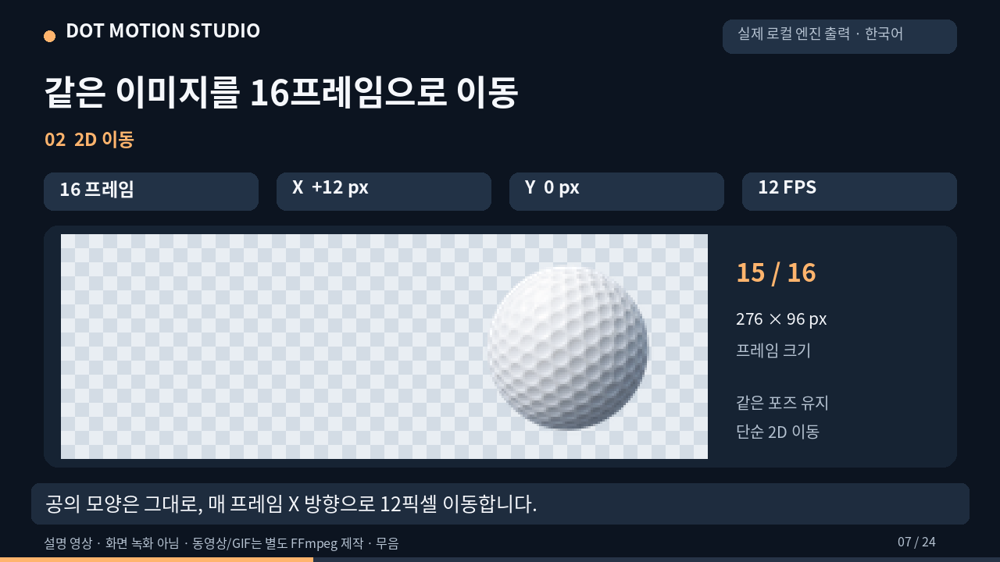

# 골프공 PNG로 따라 하는 2D 이동 데모

[24초 한국어 설명 영상 보기](./dot-motion-demo-ko.mp4) · [텍스트 설명](./TRANSCRIPT.ko.md)

[](./dot-motion-demo-ko.mp4)

## 무엇을 만든 예제인가요?

투명 골프공 PNG 한 장을 오른쪽으로 일정하게 이동하는 **16개 프레임**으로 만들었습니다. 결과는 PNG 아틀라스, JSON, PNG 시퀀스 ZIP입니다.

1. [입력 PNG](./golf-ball-input.png)를 준비합니다. 이 예제는 96×96픽셀입니다.
2. 2D 이동을 선택하고 프레임 수 16, X 이동 +12, Y 이동 0, FPS 12로 설정합니다.
3. 여백은 0으로 하고, 바깥 여백 자르기를 해제합니다. 알파 정리는 0으로 둡니다.
4. 만들어진 프레임을 확인하고 [아틀라스 PNG](./golf-ball-atlas.png), [JSON](./golf-ball-atlas.json), [프레임 ZIP](./golf-ball-frames.zip)을 가져갑니다.

위 숫자는 실제 로컬 엔진 실행에 사용한 설정과 같습니다. 배포된 웹 앱에서 처리하려면 ChatGPT 로그인이 필요합니다.

## 범위와 재현

이 영상은 실제 로컬 엔진 출력으로 편집한 설명 자료이며 앱 화면 녹화나 라이브 MCP 연결 성공 시연이 아닙니다. 골프 스윙·새 포즈를 생성하지 않고 같은 이미지를 단순 이동합니다. **MP4·GIF는 엔진의 기본 출력이 아니라 실제 출력 프레임을 FFmpeg로 따로 조립한 파일**입니다.

[움직이는 GIF 미리보기](./dot-motion-demo-ko.gif)도 제공합니다. 768×432, 약 24초, 8 FPS, 1,519,271바이트입니다. 정확한 12 FPS 재생은 MP4를 확인하세요.

프로젝트 의존성을 준비한 후 다음 명령으로 실제 출력을 재현할 수 있습니다.

```sh
node docs/demo/generate-demo.mjs
```

[환경 준비, 영상 재현, 입력 출처, 검증 내용](./REPRODUCE.md)을 확인하세요. 영상에는 한국어 자막이 직접 들어 있고 무음입니다. [WebVTT](./dot-motion-demo-ko.vtt)와 [SRT](./dot-motion-demo-ko.srt)도 제공합니다.
