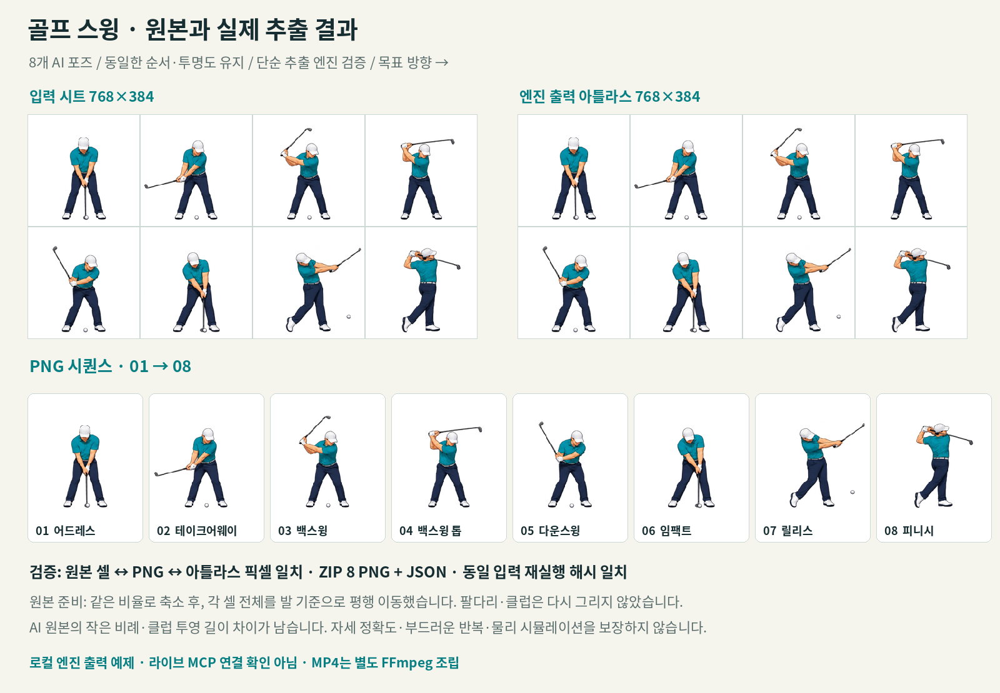

# 골프 스윙 · 8포즈 추출 데모

[한국어 MP4 보기](golf-swing-ko.mp4) · [원본/출력 비교](golf-swing-comparison.png) · [미리보기](golf-swing-poster.png)

성인 골퍼를 새로 그린 **개념 애니메이션**입니다. 오른손잡이 골퍼가 화면 오른쪽을 향해 스윙하는 8개 포즈를 보여 줍니다. 골프 레슨, 자세 교정, 모션 캡처, 생체역학 검증 자료가 아닙니다.

## 무엇을 실제로 실행했나요?

1. 내장 `image_gen.imagegen`으로 독창적인 투명 PNG 포즈 시트를 생성했습니다. 실존 인물 사진이나 외부 캐릭터는 사용하지 않았습니다.
2. 첫 결과의 3번 포즈에서 클럽 끝이 캔버스 위에 닿아, 같은 도구의 편집으로 클럽 끝과 여백을 수정했습니다. 최종 AI 원본과 두 프롬프트를 제작 기록으로 보존했습니다. 원본 PNG의 공개는 대기 중이며, 이 배포에는 준비된 엔진 입력과 출력·프롬프트를 포함합니다.
3. `prepare-input.py`가 동일 비율 축소, 셀 전체의 평행 이동, 투명 패딩만 적용해 **768×384 / 4×2 / 192×192 셀**을 만들었습니다. 발의 중심과 바닥 위치를 측정해 배치했으며, 관절·클럽·공을 다시 그리거나 부분 변형하지 않았습니다.
4. 수정하지 않은 `lib/motion-engine.mjs`의 `runPipeline`을 로컬에서 실제 실행했습니다. 명시적인 4×2 격자로 분리하고 PNG 아틀라스, 좌표·타이밍 JSON, 8개 PNG 시퀀스 ZIP을 얻었습니다.
5. 출력 PNG를 별도 Python/Pillow 화면에 배치하고 **FFmpeg**로 10초 MP4를 인코딩했습니다. 영상은 24 FPS, H.264, 1280×720, 무음입니다. 포즈 사이를 보간하지 않습니다.

영상의 첫 4초는 포즈당 0.50초, 다음 6초는 포즈당 0.75초로 느리게 반복합니다. 피니시 다음에는 어드레스로 명시적으로 다시 시작합니다. 실제 골프 스윙의 시간 비율을 재현하지 않습니다.

**이 결과는 로컬 엔진 출력 예제입니다.** 라이브 MCP 연결·등록 문제의 해결이나 UI 녹화를 증명하지 않습니다. MP4는 엔진 자체 기능이 아니며, Runway 또는 유료 영상 생성 API를 사용하지 않았습니다. AI 이미지 생성은 내장 도구를 사용했습니다.

## 포즈 순서와 시각 점검

| 번호 | 단계 | 확인한 표현 |
|---|---|---|
| 01 | 어드레스 | 두 손이 낮은 그립에 모이고, 샤프트가 지면의 공 쪽으로 이어짐 |
| 02 | 테이크어웨이 | 손과 클럽이 화면 왼쪽으로 이동 |
| 03 | 백스윙 | 손이 왼쪽 어깨 쪽으로 올라가며 클럽 헤드가 위로 이동 |
| 04 | 백스윙 톱 | 높이 든 그립에서 샤프트가 머리 위 오른쪽으로 이어짐 |
| 05 | 다운스윙 | 손이 낮아지고 클럽이 뒤에 남은 표현 |
| 06 | 임팩트 | 낮은 그립과 샤프트가 지면의 공 위치로 이어짐 |
| 07 | 릴리스 | 팔과 클럽이 목표 방향인 화면 오른쪽으로 나가고, 공은 그 다음 위치에 표시됨 |
| 08 | 피니시 | 체중 이동과 뒤꿈치 들림, 어깨 쪽에 모인 그립 표현 |

최종 8개 원본 포즈, 실제 추출 PNG, MP4의 두 재생 구간을 모두 검토했습니다. 육안으로 두 손의 그립 접촉, 한 개의 연속된 샤프트, 작은 일반 아이언 헤드, 화면 내 목표 방향과 임팩트 전후 순서를 확인했습니다. 클럽과 인물은 각 셀 안에 있으며 확대된 대형 헤드나 잘린 클럽 끝은 보이지 않습니다. 이는 전문적인 스윙 적합성 판정이 아닙니다.

남은 한계:

- AI 원본의 머리 방향·몸 비례·클럽의 투영 길이·손의 세부 모양이 조금씩 달라집니다
- 특히 백스윙 톱과 피니시의 손/팔 배치는 단순화된 그림이며, 손가락과 그립의 실제 역학적 정확성을 보장하지 않습니다
- 공의 위치는 8개 원본 그림에 포함되어 있으며 연속 탄도나 충돌을 시뮬레이션하지 않습니다
- 04번 백스윙 톱에서 지면의 공이 보이지 않는 작은 연속성 오류가 남아 있습니다. 01·06번에서는 작은 출력 크기에서 공과 클럽 헤드가 겹쳐 보입니다
- 발 위치를 셀 전체 평행 이동으로 맞췄지만 체중 이동과 신체 모션이 물리적으로 계산된 것은 아닙니다
- 8개 키 포즈를 홀드하므로 움직임은 계단식이며, 마지막/처음 연결은 매끄러운 루프가 아닙니다

## 파일

- AI 생성 원본 PNG(1774×887): **공개 대기 중, 이 배포에 미포함**. 엔진에 직접 넣지 않았으며, 출처 기록의 파일명·해시는 제작 당시 식별 정보입니다
- `generation-prompts.json`: 최초 생성 및 여백 수정 프롬프트
- `golf-swing-input.png`: 엔진 입력 시트, 768×384, 투명 RGBA
- `golf-swing-atlas.png` / `golf-swing-atlas.json`: 실제 엔진 아틀라스와 메타데이터
- `golf-swing-frames.zip`: 실제 엔진의 8 PNG + JSON
- `frames/`: ZIP에서 확인·저장한 8개 PNG
- `golf-swing-options.json`: 엔진 실행 옵션
- `golf-swing-ko.mp4`: 한국어 라벨과 설명이 있는 10초 영상
- `golf-swing-ko.srt` / `TRANSCRIPT.ko.md`: 한국어 자막 및 읽을 수 있는 설명
- `golf-swing-comparison.png` / `golf-swing-poster.png`: 원본/출력 비교와 영상 미리보기
- `input-provenance.json` / `engine-verification.json` / `media-verification.json`: 재현·검증 기록
- `visual-review.json`: 8개 단계의 육안 검토와 남은 한계
- `SHA256SUMS.txt`: 이 폴더의 공개 산출물·스크립트 체크섬

엔진 입력은 131,237바이트 / 294,912픽셀입니다. 프레임+아틀라스 합계는 589,824픽셀로 1,000,000픽셀 제한 안에 있습니다. 프레임은 8개입니다. 준비 과정에서 알파를 임의 제거하지 않았고, 엔진 `alphaThreshold: 0`은 완전히 투명한 픽셀의 RGB만 0으로 정규화합니다.

## 검증과 재현

[재현 명령](REPRODUCE.md)을 참조하세요. 검증은 실제 엔진 결과의 원본 셀 ↔ PNG ↔ 아틀라스 픽셀 일치, ZIP 구조, 순서·좌표·타이밍, 같은 입력 재실행의 바이트 일치, MP4의 코덱·길이·240프레임 및 모든 인코딩 프레임의 포즈 순서를 확인합니다.

원본 생성은 비결정적입니다. **현재 공개 파일로는 준비된 `golf-swing-input.png` 이후의 엔진 추출·아틀라스·ZIP·화면 조립을 재현할 수 있습니다. AI 원본 공개와 원본에서 입력을 만드는 준비 단계의 공개 재현은 대기 중입니다.** `prepare-input.py --use-prepared`는 공개 입력의 해시만 확인하고 원본 준비를 건너뜁니다. 라이브러리나 FFmpeg 버전이 달라지면 인코딩 바이트 해시가 달라질 수 있으므로 제공 산출물의 정확한 해시 검증과 재인코딩 결과 검증을 구분합니다.
